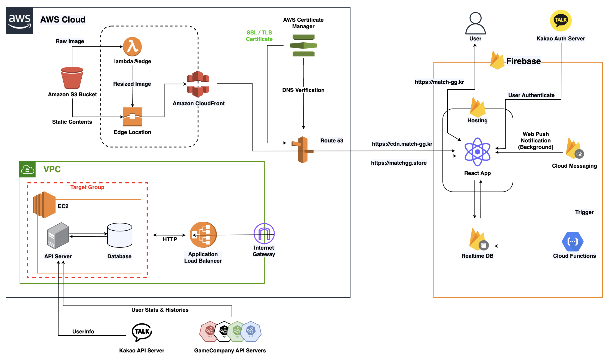

> 매치지지 서비스는 2024-02-29일 이후로 비활성화하였습니다.

# 매치지지 - 게이머 매칭 플랫폼

**기존 줄글 및 게시판 형태의 매칭 서비스의 불편함을 해결하기 위한 프로젝트, 매치지지**

## 프로젝트 구조

## 주요 기능

- 소셜 로그인 및 회원가입
- 회원정보 수정
- 게시글 작성 / 수정 / 삭제 / 조희
- 리그오브레전드 / 배틀그라운드 / 발로란트 / 오버워치2 에 대한 사용자 전적 요약
- 매칭 이후 사용자 상호 평가
- 실시간 채팅
- 인 앱 및 웹 푸시 알림

## 프로젝트 진행하며 고민한 것들

* 기존 줄글 및 게시판 형태 매칭 서비스 개선하기
	* [카드형 디자인 도입](https://zooby.notion.site/MatchGG-6853a40d89cc4dd0aa2208c8a7623225?pvs=74)

* 이미지 렌더링 사이즈보다 너무 큰 원본사이즈를 가져오는 문제
	* [AWS Lambda@Edge 를 활용한 이미지 리사이징이 가능한 CDN 도입](https://github.com/matchggkr/matchgg_image_resize)

* axios에 React.Suspense가 적용되지 않는 문제
	* 왜 Suspense와 ErrorBoundary를 적용하게 되었는가?
		* [React의 Error Boundary를 이용하여 효과적으로 에러 처리하기](https://fe-developers.kakaoent.com/2022/221110-error-boundary/)
		* [Suspense와 선언적으로 Data fetching처리](https://fe-developers.kakaoent.com/2021/211127-211209-suspense/)
  * `react-query` 나 `swr` 을 사용해서도 해결가능
	* [`PromiseWrapper` 를 활용하기](https://zooby.notion.site/Suspense-ErrorBoundary-83e3eb38b6a9430da1376ea2cd0865fa?pvs=74)

* 채팅을 Firebase RealtimeDB를 활용해 구현하며 발생한 문제
  * `onChildAdded` 리스너가 중복으로 설정되는 문제
    * 원인 : 페이지 전환 간 동일한 경로에 대한 `onChildAdded`를 다시 설정하며 발생
  * 동일한 사용자에 대한 정보를 두 개의 다른 DB 에 중복하여 저장해야 하는 문제

## 사용 기술

### FE 
- React 18
- Redux-toolkit
- Axios
- Firebase Hosting

### Chat & Notification
- Firebase JavaScript SDK
- Firebase RealtimeDB
- Firebase Cloud Functions
- Firebase Cloud Messaging

##  시연 영상
https://www.youtube.com/watch?v=LWVoYQ6rnAw
